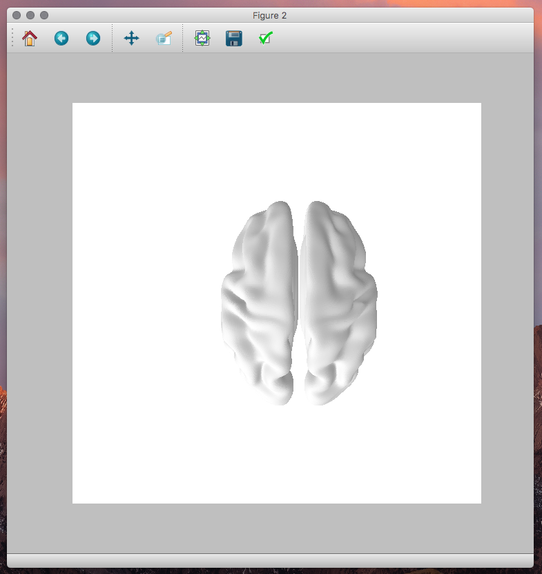

# Py-Template-Cortical-Mesh
Py Template Cortical Mesh

Simple template cortical surface / mesh for overlaying stuff on.

```
PlotTemplMeshTest.py          # is an inflated mesh, read from textfiles.
TamplateCorticalMeshPython.py # is a standard mesh read from gifti
```


